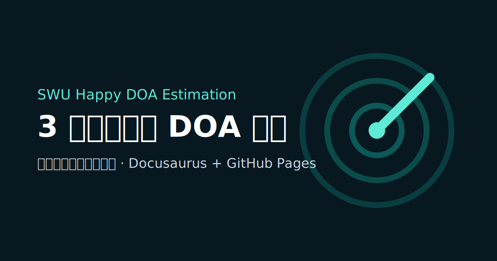

# SWU-happy-doa-estimation



面向本科生的雷达 DOA 估计开源入门课程仓库，采用 `Docusaurus + GitHub Pages + Python` 的低维护方案搭建。

项目承诺分两层推进：

- `V1`：3 周完成雷达 DOA 估计入门，学生能完成环境配置、理解阵列与来波方向基本概念、运行并修改第一组仿真实验。
- `路线图`：总计 10 周逐步建设完整课程，后续 7 周扩展到传统超分辨率方法和基于深度学习的 DOA 估计。

## 当前仓库包含什么

- `website/`：Docusaurus 教程站
- `docs/`：课程正文文档
- `examples/`：面向学生的最小可运行示例
- `src/`：教学示例复用的 Python 模块
- `tests/`：最小自动化测试

## 课程入口

- 学习路线：`docs/course-roadmap.md`
- 快速开始：`docs/quickstart.md`
- 入门样章：`docs/doa-intro/index.md`

## 本地预览教程站

首次安装依赖：

```powershell
cd website
cmd /c npm.cmd install
```

开发预览：

```powershell
cmd /c npm.cmd start
```

生产构建并本地预览：

```powershell
cmd /c npm.cmd build
cmd /c npm.cmd serve
```

## 运行 Python 示例

如果你已经有 `rfgen` conda 环境，优先使用它：

```powershell
conda activate rfgen
pip install -r requirements.txt
python examples/doa_intro_array_scan.py
```

如果没有现成环境，可自行创建 Python 3.10+ 环境并安装：

```powershell
python -m venv .venv
.venv\Scripts\activate
pip install -r requirements.txt
python examples/doa_intro_array_scan.py
```

## 自动化验证

```powershell
python -m unittest discover -s tests -v
cd website
cmd /c npm.cmd build
```

## GitHub Pages

GitHub Actions workflow 位于 `.github/workflows/deploy.yml`。
站点默认按 GitHub Pages 项目页部署，仓库公开后可直接启用 Pages 工作流。