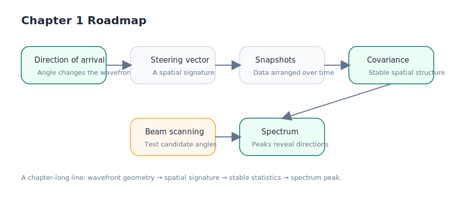

# 1.1 概览

DOA（Direction of Arrival，波达方向）估计要回答的问题很直接：**信号是从哪个方向来的**。

雷达接收机并不会直接读出一个角度值。它真正拿到的，是同一束电磁波到达不同阵元时留下的细小差别。这些差别可能表现为时间先后，也可能表现为相位推进。DOA 估计的任务，就是把这些分散在阵列各个通道里的差别，重新整理成一个可解释的方向结论。

如果你需要一个直观画面，可以把阵列理解成“一排同时听见同一个声音的耳朵”。它们看到的不是目标本身，而是波前扫过阵列时留下的空间痕迹。第一章要做的，就是把这条链路一步一步拆开：从路径差和相位差出发，走到导向矢量、协方差矩阵，最后落到第一张空间谱。

_图 1.1 第一章的主线很简单：外部空间中的来向，先在阵列上变成路径差和相位差，再被组织成数据矩阵与协方差矩阵，最后在空间谱上表现为可观察的峰值。_

## 这一章要解决什么

刚接触 DOA 时，很多人容易一上来就被公式吓住。但如果只记符号，不知道每个量在描述什么，后面看到 MUSIC、ESPRIT 或深度学习方法时，仍然会失去方向。

所以这一章的目标不是追求“最强算法”，而是先把几个最核心的问题讲清：

- 阵列为什么能区分不同方向的信号？
- “路径差”和“相位差”为什么会变成后续模型的起点？
- 为什么经典 DOA 方法几乎都会围绕导向矢量和协方差矩阵展开？
- 空间谱上的峰值，到底是怎么从真实数据里冒出来的？

如果这几个问题能连成一条线，后面无论你继续学经典超分辨算法，还是转向深度学习方法，都会更稳。

## 第一章的学习路线

这一章按“物理现象 -> 数学对象 -> 可观察结果”的顺序推进。

在 [1.2 窄带远场阵列信号模型](./02-quickstart.md) 中，我们先回答最底层的问题：当一束波斜着扫过阵列时，相邻阵元之间到底发生了什么。远场和窄带这两个假设，会把“传播时间差”整理成更好处理的“相位差”。

接着在 [1.3 均匀直线阵几何与导向矢量](./03-array-basics.md) 中，我们把这种方向相关的相位模式压缩成一个更紧凑的对象：导向矢量。它可以看成某个方向在阵列上的“空间指纹”。

有了方向指纹之后，下一步是处理真实观测数据。在 [1.4 快拍、协方差矩阵与数据表示](./04-snapshots-covariance.md) 中，我们会看到为什么单次观测不够稳，为什么需要把多个快拍组织成数据矩阵，并进一步压缩成协方差矩阵。

最后，在 [1.5 常规波束形成与第一张空间谱](./05-first-experiment.md) 中，我们把前面的对象串起来：用导向矢量去扫描角度，用协方差矩阵去衡量能量响应，得到第一张真正可读的空间谱。

## 读完这一章，你应该会什么

如果这一章读完后，你能做到下面三件事，这一章就达标了：

- 用白话说明 DOA 在解决什么问题，而不是只会背英文缩写。
- 看到 `x(t) = a(\theta)s(t) + n(t)` 这样的模型时，知道每一项各自代表什么角色。
- 理解为什么“扫角度”会产生空间谱，以及为什么谱峰会和目标方向相关。

你不需要现在就记住全部推导细节，但应该开始建立一个稳定的认识：DOA 不是凭空从矩阵里“算出角度”，而是先有阵列上的空间差异，后有模型和算法去读取这些差异。

接下来就从最基础的一步开始：当一束波从远方入射时，相邻阵元之间究竟留下了什么差别。请进入 [1.2 窄带远场阵列信号模型](./02-quickstart.md)。
