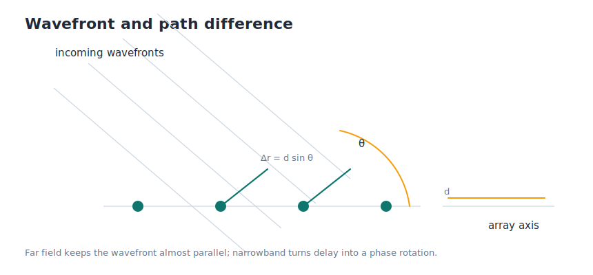

# 1.2 窄带远场阵列信号模型

这一节只回答一个问题：**当一束波从远方斜着打到阵列上时，接收机到底看到了什么？**

答案不是“角度”，也不是某个已经算好的方向标签。接收机真正拿到的，是每个阵元收到的复信号序列。不同阵元之间最重要的差别，来自波前扫过阵列时留下的路径差和时间差。DOA 估计后面所有的模型，都是在整理这件事。



_图 1.2 当平面波以角度 `θ` 入射时，相邻阵元之间会出现稳定的路径差。只要把这个几何关系写清楚，后面的相位模型就顺下来了。_

## 接收机先看到的是路径差

设阵元间距为 `d`，信号入射角为 `θ`。当波前斜着扫过阵列时，相邻阵元之间会多走一小段路。对均匀直线阵来说，这段额外路径可以写成：

```text
Δr = d sin θ
τ = Δr / c
```

这里的 `Δr` 是路径差，`τ` 是相邻阵元之间的到达时延，`c` 是传播速度。它们说的是同一件事：同一束波不会同时到达所有阵元。

如果现在就直接拿这个时延去做推导，式子会比较笨重。为了把问题先压缩成一个适合入门的模型，我们通常再加上两个假设：远场和窄带。

## 远场让波前近似为平面波

远场（far-field）假设的意思是：信号源离阵列足够远，以至于到达阵列的球面波在局部可以看成平面波。

这个假设带来的直接好处是，**相邻阵元之间的路径差是固定的**。也就是说，我们暂时不用再追踪目标距离，只需要关心方向 `θ` 如何影响阵列上的时延模式。

如果没有远场假设，不同阵元看到的波前曲率会不同，模型会复杂很多。第一章先不走那条路。

## 窄带把时延改写成相位差

窄带（narrowband）假设最重要的作用，不是“信号只有一个频率”，而是让阵元间的小时间延迟可以近似成一个相位旋转：

```text
s(t - τ_m) ≈ s(t) exp(-j 2π f_c τ_m)
```

这里的 `τ_m` 是第 `m` 个阵元相对参考阵元的时延，`f_c` 是载频。这条近似的意思很简单：对于窄带信号，阵元间的延迟主要表现为相位差，包络本身可以近似看成没变。这样一来，阵列问题就从“处理许多不同的延迟波形”变成了“处理一串有规律的相位旋转”。

这一步非常关键，因为后面的导向矢量、本章的空间谱，以及第二章的经典算法，基本都建立在这个表达上。

## 最小接收模型

```text
x_m(t) = s(t) exp(-j 2π m d sin θ / λ) + n_m(t),   m = 0, 1, ..., M-1
```

这个式子说的是：第 `m` 个阵元收到的信号，由三部分组成。

- `s(t)` 是所有阵元共享的源信号。
- 指数项 `exp(...)` 负责把方向 `θ` 对应的相位差写进去。
- `n_m(t)` 是第 `m` 个阵元上的噪声。

对 DOA 来说，最重要的信息就在指数项里。不同方向会产生不同的相位推进模式，这些模式就是后续估计方向的线索。

把所有阵元的接收信号堆成一个列向量，模型可以写得更紧凑：

```text
x(t) = a(θ)s(t) + n(t)
```

这里的 `a(θ)` 就是导向矢量。它把某个方向对应的相位模式打包成了一个统一对象。下一节我们会专门把它展开。

## 用一段代码看相位是怎么变化的

下面这几行代码只做一件事：给定角度 `theta_deg`，算出 4 个阵元上的相位模式。

```python
m = np.arange(4)
phase = -2 * np.pi * 0.5 * m * np.sin(np.deg2rad(theta_deg))
a = np.exp(1j * phase)
```

如果把 `theta_deg` 分别设成 `0`、`30` 和 `-30`，你会看到三组不同的复数结果。代码表面上只是在算指数，实际上它是在告诉你：**不同方向，会在阵列上留下不同的相位模式。**

这一节先停在这里。现在你应该已经有了一个稳定认识：DOA 模型的起点不是“角度公式”，而是阵列上的路径差和相位差。接下来进入 [1.3 均匀直线阵几何与导向矢量](./03-array-basics.md)，把这种方向相关的相位模式整理成一个可直接使用的数学对象。
