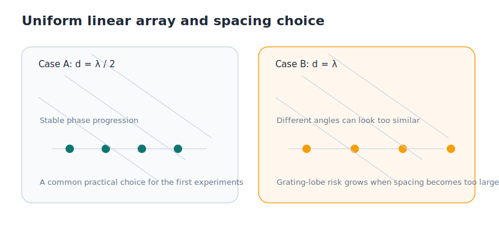

# 1.3 均匀直线阵几何与导向矢量

上一节已经把问题压缩到了一个更清楚的形式：方向 `θ` 会在阵列上留下有规律的相位差。现在我们需要再往前走一步，把这种规律写成一个能直接放进模型里的对象。

这个对象就是导向矢量（steering vector）。它听起来像个复杂术语，本质上却很朴素：**它只是把某个方向在整个阵列上留下的相位模式按顺序记下来。**



_图 1.3 对均匀直线阵来说，一个方向对应一组相位阶梯。阵元间距不同，这个阶梯的陡峭程度也会不同。_

## 为什么先学均匀直线阵

均匀直线阵（ULA）是入门 DOA 最常见的阵型，不是因为它覆盖了所有真实工程，而是因为它把几何关系写得最清楚。

当阵元等间距排成一条直线后，来自方向 `θ` 的平面波会让相邻阵元之间出现相同的路径差。于是整条阵列上会形成一个稳定的相位阶梯，而不是一团杂乱的相位偏移。

这就是 ULA 最重要的好处：同一个方向，能在整个阵列上留下一种可重复、可计算、可比较的模式。

## 从几何关系到相位阶梯

对于 ULA，相邻阵元之间的路径差和相位差分别是：

```text
路径差 Δr = d sin θ
相位差 Δφ = 2π d sin θ / λ
```

这两条式子可以这样读：

- `Δr` 由阵元间距 `d` 和入射角 `θ` 决定。
- `Δφ` 则把这个几何差异转换成复指数里的相位差。

于是，第一根阵元的额外相位可以记作 `0`，第二根是 `Δφ`，第三根是 `2Δφ`，一直排下去。方向 `θ` 不再只是一个角度，它开始变成一整串有规律的相位值。

## 导向矢量到底是什么

把刚才那串相位模式按阵元顺序写成列向量，就得到导向矢量：

```text
a(θ) = [1, exp(-jΔφ), exp(-j2Δφ), ..., exp(-j(M-1)Δφ)]^T
```

这条式子并不神秘。它只是把“某个方向对应的相位阶梯”打包保存了下来。后面不管是做波束形成、匹配方向，还是做子空间方法，都会反复用到它。

如果要把它翻成白话，可以直接理解成：`a(θ)` 是方向 `θ` 在阵列上的模板。真实数据如果和这个模板更匹配，那么这个方向就更值得怀疑。

下面这段最小代码就对应了这个定义：

```python
def steering_vector(M, d_over_lambda, theta_deg):
    m = np.arange(M)
    phase = -2 * np.pi * d_over_lambda * m * np.sin(np.deg2rad(theta_deg))
    return np.exp(1j * phase)
```

这段代码的输出就是 `a(θ)`。你改动 `theta_deg`，得到的就是不同方向在阵列上的不同模板。

## 为什么常用半波长间距

很多入门例子都会默认 `d = λ / 2`。这是一个很常见也很实用的选择，因为它在“分辨能力”和“空间歧义”之间做了比较稳的平衡。

如果阵元排得太密，阵列总孔径会变短，空间分辨率会下降，谱峰更容易变宽。如果阵元排得太开，不同方向可能产生相同的相位模式，出现空间歧义，也就是常说的栅瓣问题。

可以用两组间距做最小对比：

```python
a_half = steering_vector(M=8, d_over_lambda=0.5, theta_deg=30)
a_one = steering_vector(M=8, d_over_lambda=1.0, theta_deg=30)
```

这段代码本身只是在算两个导向矢量，但它提醒你一个事实：阵元间距并不是“越大越好”。一旦超过合理范围，阵列就可能把不同方向误认成同一种模式。

所以，在第一章里把 `d = λ / 2` 作为默认设置是合理的。它不是唯一合法选择，但足够稳定，也最适合先把主线学明白。

## 从模板走向真实数据

到这里，我们已经有了一个很重要的对象：给定方向 `θ`，我们可以写出它在阵列上的模板 `a(θ)`。但真实数据从来不是干净模板，它会混着噪声，也会随着时间波动。

所以，下一步不是立刻“猜方向”，而是先回答另一个现实问题：面对一连串带噪声的观测，怎样把稳定的空间结构提取出来。这就是 [1.4 快拍、协方差矩阵与数据表示](./04-snapshots-covariance.md) 要做的事。
