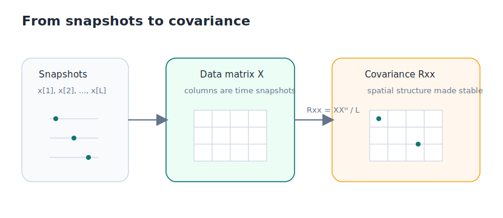
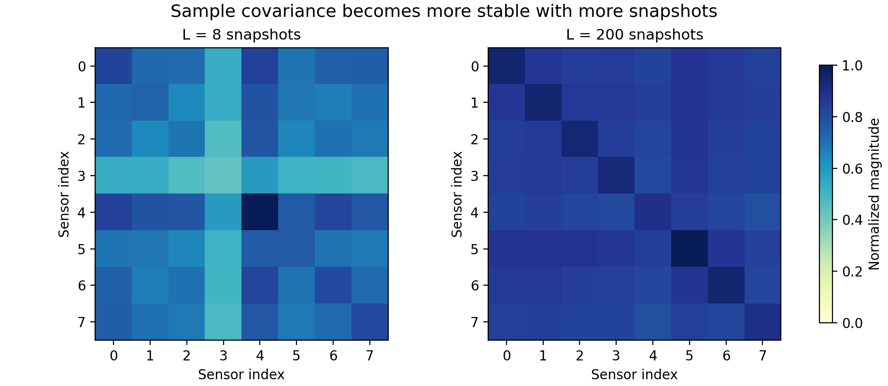

# 1.4 快拍与协方差：在噪声中寻找确定性

前两节解决的是“方向如何变成导向矢量”。这一节要解决的是另一个同样现实的问题：**真实数据带噪声，而且会随着时间变化，我们怎样把稳定的空间结构提出来？**

只看某一个瞬间的观测，通常不够稳。因为那一刻的数据同时混着目标信号、噪声、以及各种随机波动。要想后面真的画出空间谱，我们得先把“看一眼”变成“看一段时间”。



_图 1.4 这一节的主线是：先把多个瞬间的阵列观测排成数据矩阵，再把数据矩阵压缩成协方差矩阵。后者才是后续算法真正反复使用的对象。_

## 什么叫快拍

快拍（snapshot）指的是某一时刻阵列所有阵元的联合观测。把这一时刻的 `M` 个阵元数据收集起来，就得到一个长度为 `M` 的列向量：

```text
x[l] = [x_1[l], x_2[l], ..., x_M[l]]^T
```

这条式子的意思很直接：第 `l` 个快拍不是一个数，而是“这一瞬间整条阵列一起看到的内容”。

单个快拍当然也有信息，但它太容易被噪声、随机相位和瞬时波动影响。真正更有用的，是把很多个快拍一起看。

## 把快拍排成数据矩阵

如果连续收集 `L` 个快拍，并把它们按列排开，就得到数据矩阵：

```text
X = [x[1], x[2], ..., x[L]]
```

这里的 `X` 大小是 `M × L`。行数对应阵元数，列数对应快拍数。

它保留了这一小段观测窗口里的原始阵列数据。只要 `L` 足够大，噪声的随机成分会在统计上逐渐平均掉，而由目标方向带来的空间相关结构会越来越稳定。

但直接拿 `X` 做后续估计仍然有点笨重。我们还需要一步压缩，把这段时间里的空间结构提炼出来。

## 协方差矩阵保留了什么

这一步压缩的结果，就是样本协方差矩阵：

```text
R_xx = (1/L) X X^H
```

这里的上标 `H` 表示共轭转置。这条式子可以直接理解成：用多个快拍去估计“阵元和阵元之间平均是什么关系”。

- 对角线元素主要反映各阵元的平均功率。
- 非对角线元素反映阵元之间的相关性和相位关系。

也就是说，`R_xx` 不是在保存某一时刻的瞬时值，而是在保存这段观测里更稳定的空间结构。后面的波束形成、MUSIC、ESPRIT 都会依赖这个对象。



_图 1.5 快拍数少时，协方差矩阵会更粗糙、更不稳定；快拍数增加后，真正的空间相关结构会更清楚。图里展示的不是“更漂亮的图片”，而是统计估计更稳定了。_

## 用代码把原始数据压缩成协方差

下面这几行代码就是最常见的样本协方差计算：

```python
X = np.column_stack(snapshots)
R_xx = X @ X.conj().T / X.shape[1]
```

第一行把多个快拍并成一个 `M × L` 的数据矩阵。第二行做的是“乘上共轭转置再取平均”，得到的就是 `M × M` 的协方差矩阵。它比原始数据小得多，也更适合后续算法直接使用。

## 为什么下一节终于可以画空间谱了

到这里，第一章前半段需要的对象已经齐了：

- [1.3](./03-array-basics.md) 给了我们方向模板 `a(θ)`；
- 这一节给了我们真实数据的稳定统计表示 `R_xx`。

下一节要做的事就很自然了：拿着不同方向的模板去扫描，看看哪个方向和 `R_xx` 更匹配。这个“扫描并比较”的过程，会直接生成你的第一张空间谱。请进入 [1.5 常规波束形成与第一张空间谱](./05-first-experiment.md)。
