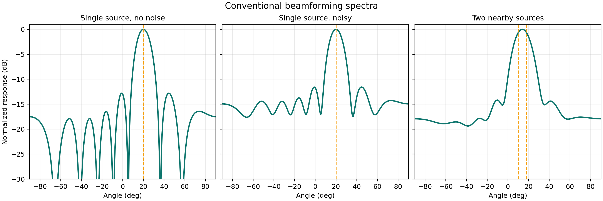

# 1.5 常规波束形成：你的第一张空间谱

到这里，第一章最重要的两个对象已经准备好了：

- 用来描述某个方向模板的导向矢量 `a(θ)`
- 用来描述真实观测统计结构的协方差矩阵 `R_xx`

现在要做的事情很直接：给定一组候选角度，逐个去试，看看哪个方向和真实数据最匹配。最朴素的做法，就是常规波束形成（CBF, conventional beamforming）。



_图 1.6 这就是空间谱。左图中单目标峰值清晰；中图加入噪声后背景抬高，但主峰仍可见；右图中两个目标靠得太近，谱峰开始粘连，暴露出阵列分辨率的限制。_

## 为什么要扫描角度

CBF 的想法并不复杂。既然每个方向都有自己的导向矢量模板，那我们就把角度网格上的候选方向一个一个试过去。对于每个候选角度 `θ`，都问同一个问题：

**如果真实信号真的来自这个方向，那么按照这个方向做加权后，阵列输出的能量会不会更大？**

这就是“扫描角度”的本质。它不是在盲猜，而是在用一组方向模板去和真实数据逐个对照。

## CBF 的公式在做什么

常规波束形成通常写成下面这个形式：

```text
猜想的加权向量：w(θ) = a(θ) / M
计算该角度的输出功率：P_CBF(θ) = w(θ)^H R_xx w(θ)
```

这里的上标 `H` 表示共轭转置。`w(θ)` 是针对候选方向 `θ` 构造出来的加权向量。`P_CBF(θ)` 则是把这个方向模板拿去和协方差矩阵匹配后得到的输出功率。

如果候选方向和真实来向一致，阵列各通道的相位会更容易对齐，输出功率就更大；如果方向猜错了，各通道会更难叠加起来，输出功率就更小。把所有候选角度的 `P_CBF(θ)` 画成曲线，就得到了空间谱。

## 图 1.6 应该怎么看

图 1.6 可以按三件事来看。

第一，看主峰位置。主峰对应的角度，就是算法最怀疑的来向位置。

第二，看噪声背景。噪声越强，谱图底噪越高，峰值和背景的对比会变差。

第三，看主瓣宽度和相邻峰值是否分得开。阵列孔径有限，所以真实方向附近不会只出现一根无限细的针，而会出现一个有宽度的主瓣。当两个目标过近时，这两个主瓣就会粘在一起，变得难以区分。

这也是为什么 CBF 是很好的入门起点，但分辨率有限。它能让你先看清“空间谱是怎么来的”，也会顺便暴露出经典波束形成的边界。

## 最小代码骨架

下面这段代码已经够把 CBF 的核心流程跑通：

```python
grid = np.linspace(-90, 90, 361)
spec = [np.real((a(th) / M).conj() @ R_xx @ (a(th) / M)) for th in grid]
peak = grid[np.argmax(spec)]
```

第一行建立候选角度网格；第二行对每个候选角度计算输出功率；第三行找出谱峰所在位置。代码很短，但它把第一章所有对象都串起来了。

如果你把这三行和前面几节连起来看，会发现第一章已经形成了一个完整闭环：

- [1.2](./02-quickstart.md) 解释了路径差和相位差从哪里来；
- [1.3](./03-array-basics.md) 把方向写成导向矢量；
- [1.4](./04-snapshots-covariance.md) 把真实数据压缩成协方差矩阵；
- 这一节再用导向矢量去扫描协方差矩阵，得到空间谱。

到这里，你已经有了继续学习经典 DOA 方法所需的底层图景。下一步可以进入 [第二章 经典 DOA 估计算法](../02-traditional-methods/01-overview.md)，去看为什么 MUSIC、ESPRIT 这些方法能在 CBF 的基础上把分辨率再往前推一步。
